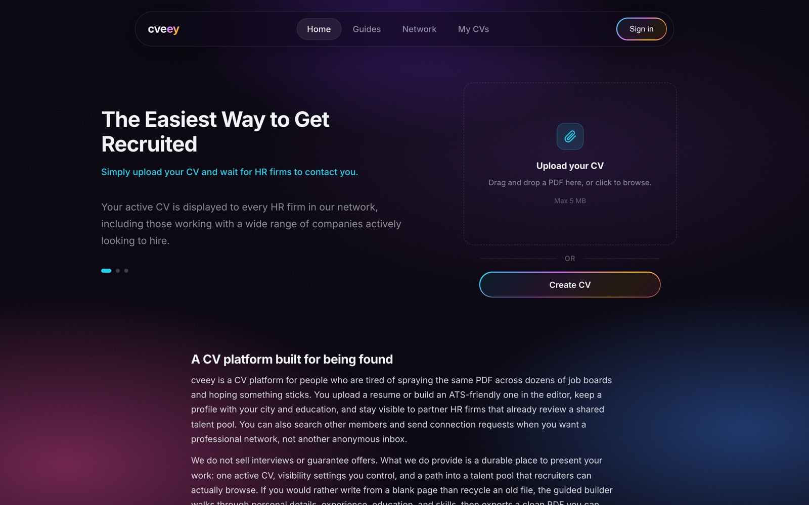
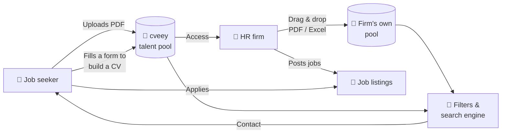
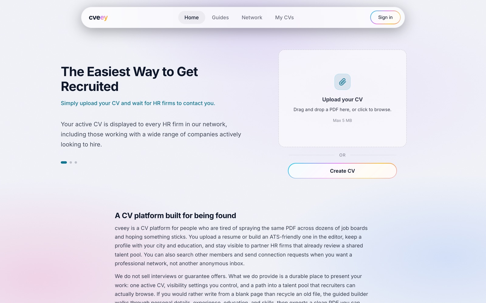
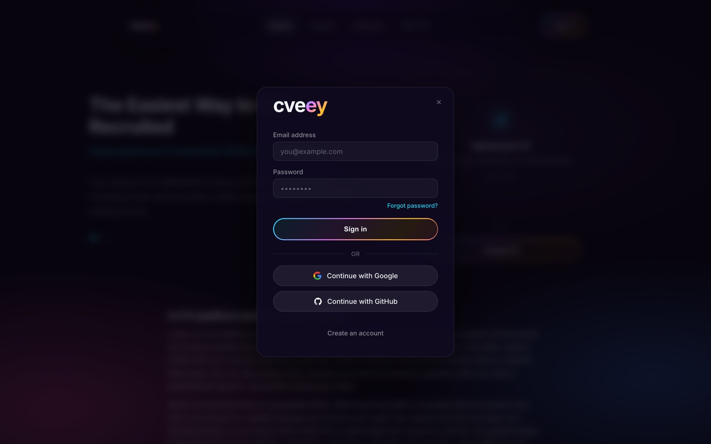
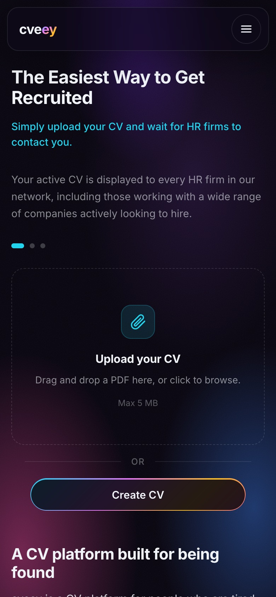
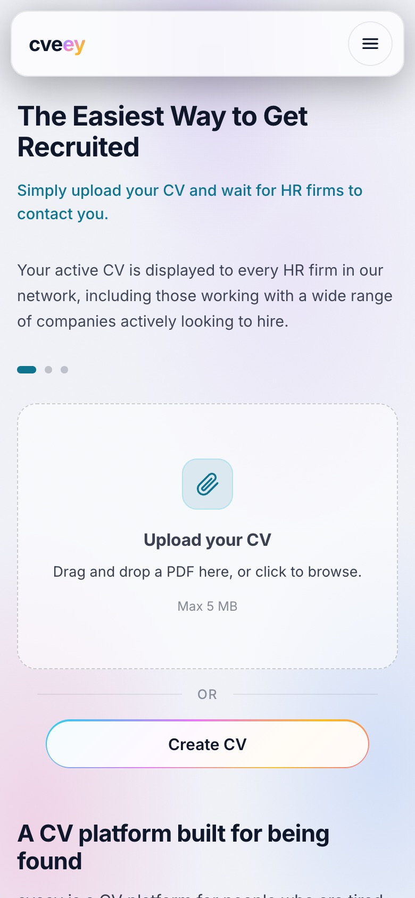
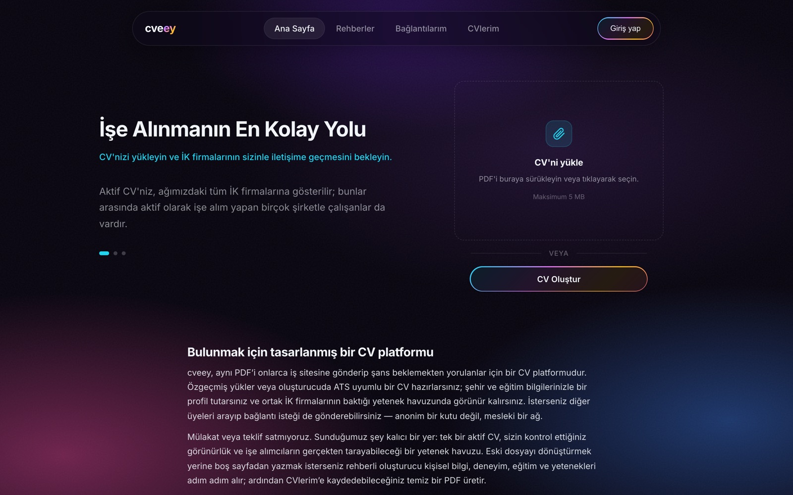
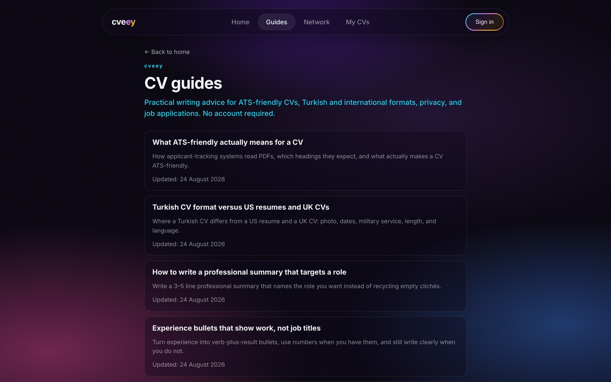
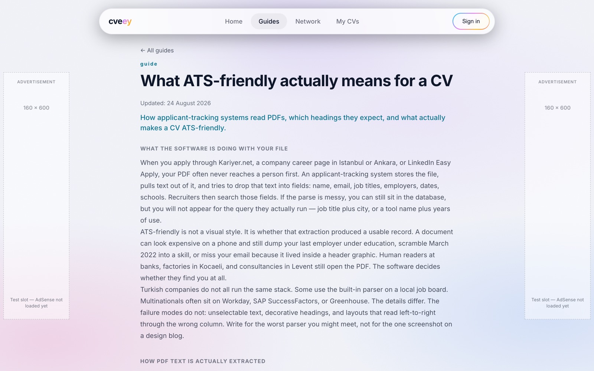

<p align="center">
  
</p>

<p align="center">
  <a href="https://www.cveey.com"></a>
  <a href="https://cveey-a7faa.web.app"></a>
</p>

<p align="center">
  
  
  
  
  
  
</p>

---

## 💡 What is cveey?

**cveey** is an HR and job-matching platform that brings job seekers and HR firms together in a single **talent pool**.

> **For job seekers:** Drop your CV and walk away. No more chasing listings across dozens of job boards or sending your CV to every employer one by one.
>
> **For HR firms:** Access to a large candidate pool **and** a tool to build and manage your own pool in minutes.

Every CV left on cveey lands in one big shared pool. Our partner HR firms get access to the candidates in that pool and can reach out to them directly.

<p align="center">
  
</p>

---

## 🧭 How it works



---

## 👤 For job seekers

| | Feature | Description |
|---|---|---|
| 📎 | **Drag & drop CV upload** | Drop your PDF (max 5 MB) and your active CV becomes visible to HR firms in the pool. |
| ✍️ | **Build a CV with a form** | No CV yet? No problem. Fill in a step-by-step form and get a clean, ATS-friendly PDF. |
| 🗂️ | **My CVs** | Keep multiple CVs and mark one as **active**. |
| 🔒 | **Visibility control** | You decide who sees your CV: connections, partner HR firms, or a narrower audience. |
| 🤝 | **Professional network** | Search other members, send connection requests, view profiles. |
| 📚 | **CV guides** | Public articles on ATS-friendly CVs, Turkish vs. international formats, summaries, and experience bullets. |
| 📢 | **Apply to job listings** 🚧 | Apply to listings posted by HR firms in one click. |

<table>
  <tr>
    <td width="50%"></td>
    <td width="50%"></td>
  </tr>
  <tr>
    <td align="center"><sub>☀️ Light theme — upload or create a CV</sub></td>
    <td align="center"><sub>🔐 Sign in with email, Google, or GitHub</sub></td>
  </tr>
</table>

---

## 🏢 For HR firms

HR firms are at the heart of cveey. We bring value in two ways:

1. **🌊 Access to a large pool** — Once the talent pool reaches our target size, we open it up to our partner HR firms.
2. **📁 Build your own pool** — Just **drag and drop** the PDF and Excel files you already have, and your own candidate pool is ready in seconds.

| | Feature | Status |
|---|---|---|
| 🌊 | Access and contact candidates in the shared talent pool | ✅ |
| 📥 | Build a firm-specific pool via PDF / Excel drag & drop | 🚧 |
| 🔎 | Rich filtering and search engine (city, education, skills…) | 🚧 |
| 📢 | Post job listings and manage applications | 🚧 |
| 🗃️ | Candidate management: find the right people, stay organized, reach them fast | 🚧 |

<sub>✅ live · 🚧 in development</sub>

---

## 📱 Every screen, every theme

<table>
  <tr>
    <td width="25%"></td>
    <td width="25%"></td>
    <td width="50%"></td>
  </tr>
  <tr>
    <td align="center"><sub>🌙 Mobile · dark</sub></td>
    <td align="center"><sub>☀️ Mobile · light</sub></td>
    <td align="center"><sub>🇹🇷 Turkish interface</sub></td>
  </tr>
</table>

<table>
  <tr>
    <td width="50%"></td>
    <td width="50%"></td>
  </tr>
  <tr>
    <td align="center"><sub>📚 CV guides</sub></td>
    <td align="center"><sub>📖 Guide article</sub></td>
  </tr>
</table>

---

## 🛠️ Tech stack

| Layer | Used |
|---|---|
| 🎨 Frontend | React 19, React Router 7, Vite 8, Lucide icons |
| 🔐 Auth | Firebase Auth — email/password, Google, GitHub |
| 🗄️ Data | Cloud Firestore (users, files, education, notifications, network) |
| 📦 Files | Firebase Storage |
| ⚙️ Backend | Firebase Cloud Functions (`functions/`) |
| 📄 PDF | `@react-pdf/renderer` (CV export), `pdfjs-dist` (preview and text) |
| 🌍 Language & theme | EN / TR, dark / light theme |
| 💰 Ads | Google AdSense (with cookie consent) — application in progress |

---

## 🚀 Getting started

```bash
npm install
cp .env.example .env   # fill in AdSense variables if needed
npm run dev
```

> [!TIP]
> For local development, it's safe to leave `VITE_ADS_ENABLED=false` in `.env`.

### 📜 Scripts

| Command | Description |
|-------|----------|
| `npm run dev` | Development server |
| `npm run build` | Production build → `dist/` |
| `npm run preview` | Preview the build locally |
| `npm run lint` | Oxlint |
| `npm run firebase:login` | Firebase CLI login |
| `npm run firebase:deploy:rules` | Firestore rules only |
| `npm run firebase:deploy:storage` | Storage rules only |
| `npm run storage:cors` | Apply Storage CORS (`cors.json`) |
| `npm run firebase:deploy:hosting` | Hosting only (`dist/`) |

See the `functions/` folder for Cloud Functions.

### 🔥 Firebase Hosting

> [!WARNING]
> Hosting publishes **only** the `dist/` folder. Don't use the repo root (`"."`) or the `public/` source folder as the hosting `public` directory, or `README.md` and source files will end up on the site.

```bash
npm run build
# dist should contain index.html + assets, and no README
npm run firebase:deploy:hosting   # run this deliberately, as a separate step
```

---

## 🗺️ Roadmap

- [x] CV upload (drag & drop PDF) and My CVs
- [x] Form-based ATS-friendly CV builder + PDF export
- [x] Profiles, visibility settings, professional network, and notifications
- [x] EN / TR interface, dark / light theme, mobile-friendly
- [x] CV guides
- [ ] Google AdSense approval
- [ ] Bring **www.cveey.com** back online
- [ ] HR firm dashboard: build pools via PDF / Excel drag & drop
- [ ] Rich filtering and candidate search engine
- [ ] Job listings and applications

---

## 📬 Contact

<p>
  <a href="mailto:egemenozyurek1@gmail.com"></a>
  <a href="mailto:a.aozmenn2001@gmail.com"></a>
</p>

<p align="center">
  <sub>cve<b>ey</b> · The easiest way to get recruited 💜</sub>
</p>
